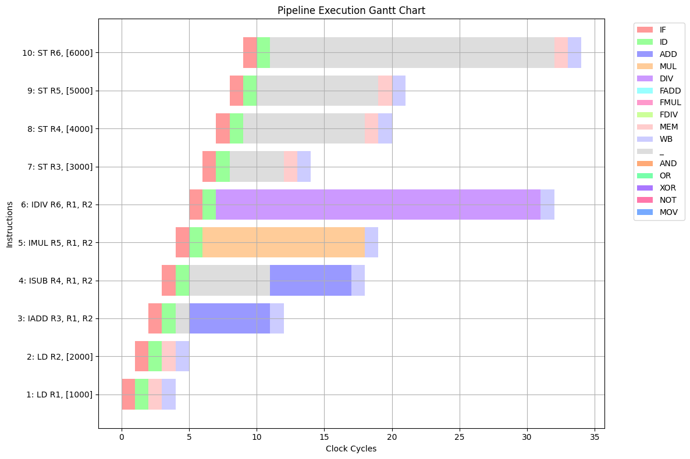

# Tomasulo's Algorithm Processor Implementation

## Introduction
Tomasulo's algorithm is an efficient dynamic scheduling technique that enables out-of-order execution while maintaining correct program behavior. This implementation handles structural and data hazards (RAW and WAW) through reservation stations and queues.

## Key Features
- Dynamic scheduling with reservation stations
- Register renaming to eliminate hazards
- Functional units with dedicated queues
- Pipeline visualization
- Comparison with VLIW approach

## Architecture Overview
### Functional Units and Queues
| Unit Type | Operations | Cycles | Queue |
|-----------|------------|--------|-------|
| Integer Adder | IADD, ISUB | 6 | FIFO |
| Integer Multiplier | IMUL | 12 | FIFO |
| Integer Divider | IDIV | 24 | FIFO |
| FP Adder | FADD, FSUB | 18 | FIFO |
| FP Multiplier | FMUL | 30 | FIFO |
| FP Divider | FDIV | 60 | FIFO |
| Logical Units | AND, OR, XOR, NOT | 1 | FIFO |
| Memory Unit | LD, ST | 1 | FIFO |

### Hazard Handling
- **Structural Hazards**: Managed via reservation stations and queues
- **RAW**: Resolved by tracking operand availability
- **WAW**: Eliminated through register renaming
- **WAR**: Prevented via register locking

## Instruction Set
| Instruction | Description | Pipeline Stages |
|-------------|-------------|-----------------|
| IADD Rdst, Rsrc1, Rsrc2 | Integer Add | IF(1), ID(1), RS, ADD(6), WB(1) |
| ISUB Rdst, Rsrc1, Rsrc2 | Integer Sub | IF(1), ID(1), RS, ADD(6), WB(1) |
| IMUL Rdst, Rsrc1, Rsrc2 | Integer Mul | IF(1), ID(1), RS, MUL(12), WB(1) |
| ... | ... | ... |

## Example Program
```assembly
LD R1, [1000]
LD R2, [2000]
IADD R3, R1, R2
ISUB R4, R1, R2
IADD R4, R4, R2
IMUL R5, R1, R2
IDIV R6, R1, R2
ST R3, [3000]
ST R4, [4000]
ST R5, [5000]
ST R6, [6000]
```

## 🚀 Performance Comparison

| Metric                | VLIW | Tomasulo | Improvement       |
|-----------------------|------|----------|-------------------|
| Total Clock Cycles    | 47   | 35       | 25.53% faster     |
| NOP Instructions      | 33   | 0        | 100% reduction    |
| Memory Ops Complete   | 47   | 35       | 12 cycles earlier |

## 💡 Key Advantages

✔ **Better Resource Utilization** - Dynamic scheduling keeps all functional units busy  
✔ **Zero NOPs** - Complete elimination of pipeline bubbles  
✔ **Memory Operation Overlap** - Stores begin immediately when operands are ready  
✔ **Efficient Queue Handling** - FIFO queues prevent structural hazards  

### Example Input:
```plaintext
# calculator program
LD R1, [1000]
LD R2, [2000]
IADD R3, R1, R2
ISUB R4, R1, R2
IMUL R5, R1, R2
IDIV R6, R1, R2
ST R3, [3000]
ST R4, [4000]
ST R5, [5000]
ST R6, [6000]
```

### Example Output:
```plaintext
Updated Code with NOPs and Register Updates:
LD R1, [1000]
LD R2, [2000]
IADD R3, R1, R2
ISUB R4, R1, R2
IMUL R5, R1, R2
IDIV R6, R1, R2
ST R3, [3000]
ST R4, [4000]
ST R5, [5000]
ST R6, [6000]

Total clock cycles: 34
 
 
Functional Units Execution:
   |       ADD       |       MUL       |       DIV       |   FADD   |   FMUL   |   FDIV   |    AND     | OR |    XOR     |    NOT     |      MEM      |
 1 |                 |                 |                 |          |          |          |            |    |            |            | LD R1, [1000] |
 2 |                 |                 |                 |          |          |          |            |    |            |            | LD R2, [2000] |
 3 | IADD R3, R1, R2 |                 |                 |          |          |          |            |    |            |            |               |
 4 | ISUB R4, R1, R2 |                 |                 |          |          |          |            |    |            |            |               |
 5 |                 | IMUL R5, R1, R2 |                 |          |          |          |            |    |            |            |               |
 6 |                 |                 | IDIV R6, R1, R2 |          |          |          |            |    |            |            |               |
 7 |                 |                 |                 |          |          |          |            |    |            |            | ST R3, [3000] |
 8 |                 |                 |                 |          |          |          |            |    |            |            | ST R4, [4000] |
 9 |                 |                 |                 |          |          |          |            |    |            |            | ST R5, [5000] |
10 |                 |                 |                 |          |          |          |            |    |            |            | ST R6, [6000] |
 
 
Clock Cycle Execution:
                    |   1   |   2   |   3   |   4   |   5   |   6   |   7   |   8   |   9   |  10   |  11   |  12   |  13   |  14   |  15   |  16   |  17   |  18   |  19   |  20   |  21   |  22   |  23   |  24   |  25   |  26   |  27   |  28   |  29   |  30   |  31   |  32   |  33   |  34   |
1: LD R1, [1000]   |  IF   |  ID   |  MEM  |  WB   |       |       |       |       |       |       |       |       |       |       |       |       |       |       |       |       |       |       |       |       |       |       |       |       |       |       |       |       |       |       |
2: LD R2, [2000]   |       |  IF   |  ID   |  MEM  |  WB   |       |       |       |       |       |       |       |       |       |       |       |       |       |       |       |       |       |       |       |       |       |       |       |       |       |       |       |       |       |
3: IADD R3, R1, R2 |       |       |  IF   |  ID   |   _   |  ADD  |  ADD  |  ADD  |  ADD  |  ADD  |  ADD  |  WB   |       |       |       |       |       |       |       |       |       |       |       |       |       |       |       |       |       |       |       |       |       |       |
4: ISUB R4, R1, R2 |       |       |       |  IF   |  ID   |   _   |   _   |   _   |   _   |   _   |   _   |  ADD  |  ADD  |  ADD  |  ADD  |  ADD  |  ADD  |  WB   |       |       |       |       |       |       |       |       |       |       |       |       |       |       |       |       |
5: IMUL R5, R1, R2 |       |       |       |       |  IF   |  ID   |  MUL  |  MUL  |  MUL  |  MUL  |  MUL  |  MUL  |  MUL  |  MUL  |  MUL  |  MUL  |  MUL  |  MUL  |  WB   |       |       |       |       |       |       |       |       |       |       |       |       |       |       |       |
6: IDIV R6, R1, R2 |       |       |       |       |       |  IF   |  ID   |  DIV  |  DIV  |  DIV  |  DIV  |  DIV  |  DIV  |  DIV  |  DIV  |  DIV  |  DIV  |  DIV  |  DIV  |  DIV  |  DIV  |  DIV  |  DIV  |  DIV  |  DIV  |  DIV  |  DIV  |  DIV  |  DIV  |  DIV  |  DIV  |  WB   |       |       |
7: ST R3, [3000]   |       |       |       |       |       |       |  IF   |  ID   |   _   |   _   |   _   |   _   |  MEM  |  WB   |       |       |       |       |       |       |       |       |       |       |       |       |       |       |       |       |       |       |       |       |
8: ST R4, [4000]   |       |       |       |       |       |       |       |  IF   |  ID   |   _   |   _   |   _   |   _   |   _   |   _   |   _   |   _   |   _   |  MEM  |  WB   |       |       |       |       |       |       |       |       |       |       |       |       |       |       |
9: ST R5, [5000]   |       |       |       |       |       |       |       |       |  IF   |  ID   |   _   |   _   |   _   |   _   |   _   |   _   |   _   |   _   |   _   |  MEM  |  WB   |       |       |       |       |       |       |       |       |       |       |       |       |       |
10: ST R6, [6000]  |       |       |       |       |       |       |       |       |       |  IF   |  ID   |   _   |   _   |   _   |   _   |   _   |   _   |   _   |   _   |   _   |   _   |   _   |   _   |   _   |   _   |   _   |   _   |   _   |   _   |   _   |   _   |   _   |  MEM  |  WB   |

Cycle 1:

Cycle 2:

Cycle 3:

Cycle 4:

Cycle 5:
  Instruction 3 acquired ADD RS. Now available: 1/2

Cycle 6:
  Released RS for ADD. Now available: 2/2
  Instruction 4 acquired ADD RS. Now available: 1/2

Cycle 7:

Cycle 8:

Cycle 9:
  Instruction 7 acquired MEM RS. Now available: 1/2

Cycle 10:
  Instruction 8 acquired MEM RS. Now available: 0/2

Cycle 11:
  MEM RS full! Instruction 9 pushed to MEM queue

Cycle 12:
  Released RS for ADD. Now available: 2/2
  MEM RS full! Instruction 10 pushed to MEM queue

Cycle 13:
  Released RS for MEM. Now available: 1/2
  Popped instruction 9 from MEM queue
  Instruction 9 acquired MEM RS. Now available: 0/2

Cycle 14:

Cycle 15:

Cycle 16:

Cycle 17:

Cycle 18:

Cycle 19:
  Released RS for MEM. Now available: 1/2
  Popped instruction 10 from MEM queue
  Instruction 10 acquired MEM RS. Now available: 0/2

Cycle 20:
  Released RS for MEM. Now available: 1/2

Cycle 21:

Cycle 22:

Cycle 23:

Cycle 24:

Cycle 25:

Cycle 26:

Cycle 27:

Cycle 28:

Cycle 29:

Cycle 30:

Cycle 31:

Cycle 32:

Cycle 33:
  Released RS for MEM. Now available: 2/2

Cycle 34:

Final Reservation Station Status:
ADD: 2/2 available
MUL: 2/2 available
DIV: 2/2 available
FADD: 2/2 available
FMUL: 2/2 available
FDIV: 2/2 available
AND: 2/2 available
OR: 2/2 available
XOR: 2/2 available
NOT: 2/2 available
MEM: 2/2 available
MOV: 2/2 available

Final Queue Status:
ADD queue: empty
MEM queue: empty
```

